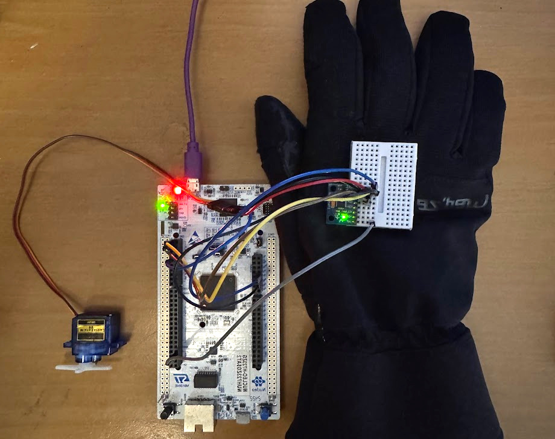

# IMU Controlled Servo

This research project showcases the development of a sophisticated motion tracking system involving a 32-bit microcontroller (STM32H723ZGT) with ARM processor and a MEMS sensor module with gyroscope and accelerometer (MPU6050). Datasheet of the MEMS module was thoroughly studied and its registers were manipulated through I2C, to set data sampling frequency, interrupt pin configuration, FIFO buffer and gyroscope scale. A control system was designed and implemented to follow the motion of the IMU using a servo motor as an actuator.

## Project Setup

## Components used

- [STM32H723G](https://www.st.com/en/microcontrollers-microprocessors/stm32h723zg.html)
- [Nucleo Development Board](https://www.st.com/en/evaluation-tools/nucleo-h723zg.html)
- [MPU6050](https://invensense.tdk.com/products/motion-tracking/6-axis/mpu-6050/)
- Servo Motor

## Demonstrations
- [Single DOF IMU controlled IMU](https://www.youtube.com/watch?v=8jMRze4Yr3I)
